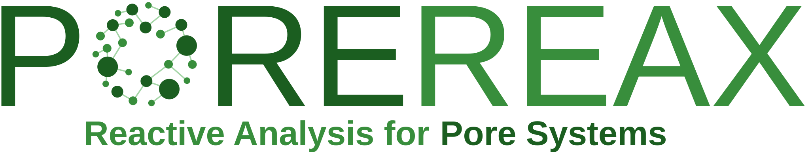

---

<!-- start elevator-pitch -->

PoreReax is a Python package for analysing and setting up reactive molecular dynamics workflows based on ReaxFF and LAMMPS. It enables you to:

- Sample and post-process trajectories with different samplers
    * Angle distributions
    * Charge distributions
    * Bond length distributions
    * Existing molecular structures
    * Density of atoms, molecules, bonds, and reactions
    * Time evolution of structures, bonds and reactions
    * Radial distribution functions (RDFs)
- Plot sampled results with built-in plotting functions
- Build simulation-ready LAMMPS input files from equilibrated GROMACS structures (`.gro`)
- Configure multi-stage ReaxFF workflows (for example NPT/NVT/NVE)

<!-- end elevator-pitch -->

## Installation

PoreReax currently targets Python 3.12+.

Direct installation from github:

```bash
python -m pip install git+https://github.com/ProkopK/PoreReax.git
```

## Quickstart

### 1) Create a simulation workflow

```python
from porereax import Simulate

gro_lib = {"OM": "O", "OW": "O", "Si": "Si", "HW": "H", "MW": ""}
gro_charges = {"OM": -0.64, "OW": -1.1128, "Si": 1.28, "HW": 0.5564}
atom_masses = {"Si": 28.086, "O": 15.9994, "H": 2.016}

sim = Simulate(gro_lib, gro_charges, atom_masses, structure_file="system.gro")
sim.set_force_field("reax.ffield")
sim.add_sim(type="nvt", nsteps=10000, temp=300)
sim.generate()
```

This generates files such as `system.data`, `run_0.lmp`, `run_0.job`, and
`ana.py`.

### 2) Analyse simulation output

```python
from porereax import Sample

atom_lib = {"Si": 1, "O": 2, "H": 3}
atom_masses = {"Si": 28.086, "O": 15.9994, "H": 2.016}

sampler = Sample(atom_lib, atom_masses, "run_0.lammpstrj", "run_0.bonds")
sampler.add_molecule_structure_sampling("molecule_structure")
sampler.add_charge_sampling(
    "charge",
    atoms=[{"atom": "O", "bonds": ["H", "H"]}],
)
sampler.add_bond_density_sampling(
    "bond_density",
    bonds=[{"bond": "Si-O", "bonds_B": ["H"]}],
    dimension="Cartesian1D",
)
sampler.sample()
```

## Documentation

Documentation is available at [https://prokopk.github.io/PoreReax/](https://prokopk.github.io/PoreReax/) and includes:

- getting started
- simulation workflow guides
- analysis workflow guides
- API reference generated from source

## License

This project is licensed under GPL-3.0.